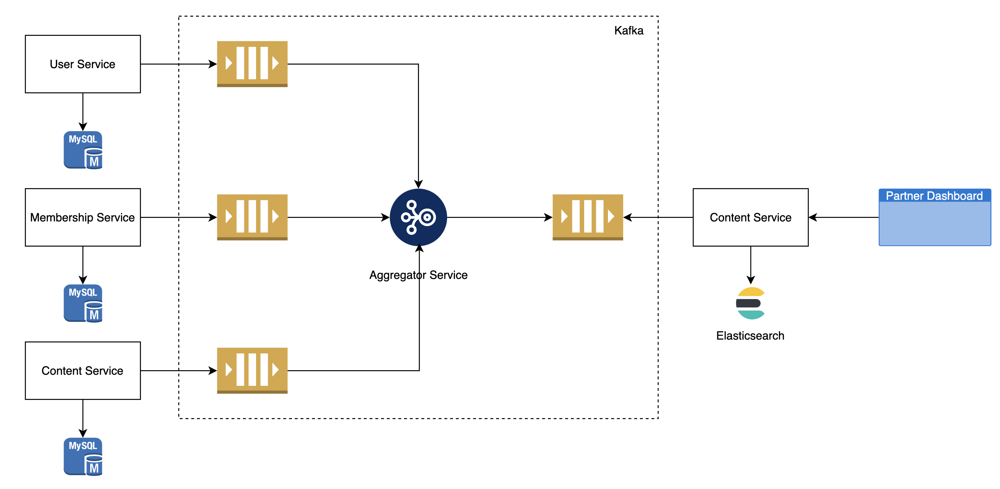

### Wireframe

### Briefly
- Data need to be combined from multiple data sources.
- Pagination is required.
- Can filter by name of user, name of membership plan.
- Can sort by membership plan name, score.

### High level design

### Kafka topics

| Topic Name                    | Description |
|------------                   |-------------|
| user-topic                    | User information|
| member-topic                  | Member in membership information |
| submission-topic              | User's submission information |
| enriched-submission-topic     | Enriched submission information |

